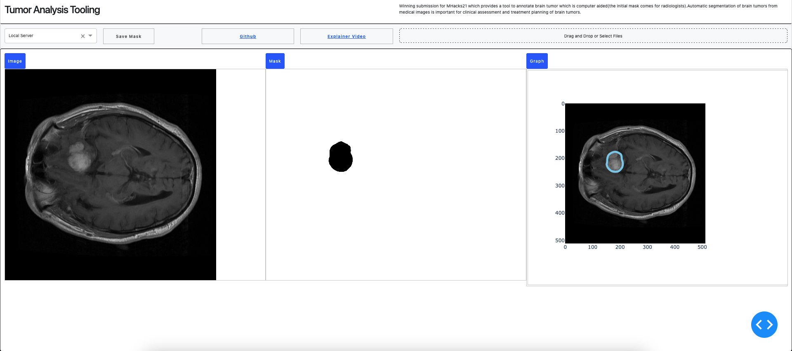

# Computer Aided Diagnosis for Brain Tumors

Annotater tool for Brain Tumor which creates the initial mask using deep learning and provides 
tool to work with on the mask after initial mask using Plotly and dash.

It's supposed to help with the work of radiologists to reduce the error and reduce repetive work.

Made with Python, OpenCV, Pytorch, NodeJS, Flask, Google Cloud Platform. 

##### MHacks'21 : Best Medical Hack category 

### 3 Main Components:
- `Model`: Holds details regarding the model that was trained and other details. Model is written in pytorch(UNET) and used figshare dataset.
- `segment_server`: Flask server that serves the inference model using REST api
- `annotation_client`: Dash app that provides the front-end to work with the segmentation server and allows for manual annoation after automatic annoation annotation is done by model.

<!-- #### Plan of Action:
 -->

#### New Developments for CSE 244
- Added a new model in models/llava-med-base.ipynb where intent is to use a large language model to help with the reasoning process and assist the doctor which utilizes the llava-med models [link](https://github.com/microsoft/LLaVA-Med)

#### Example of the app:

